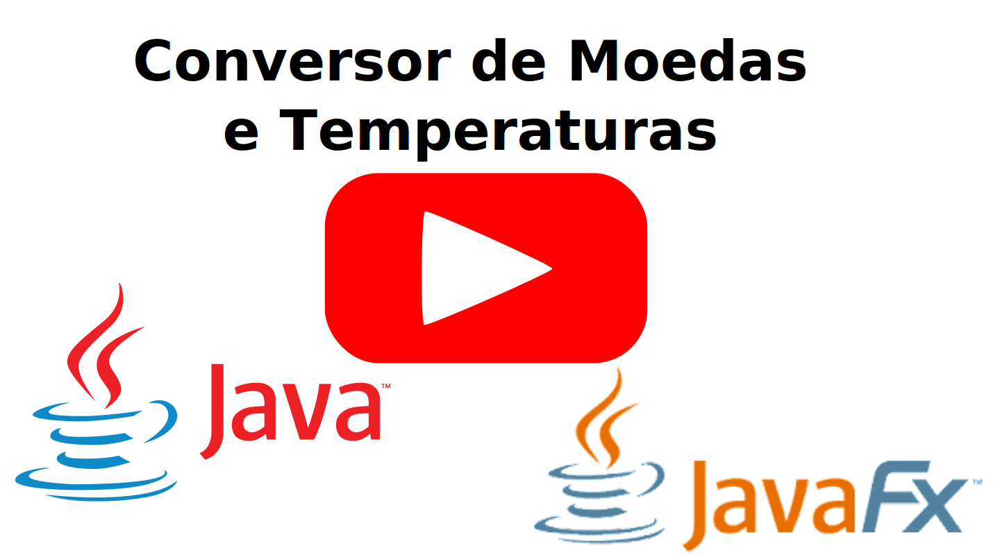

# 📌 Conversor de Moedas e de Temperaturas Java

💱 Conversor de Moeda e Temperatura feitos em Java e JavaFx.

📁 O arquivo .jar encontra-se na pasta conversor.zip junto com um atalho e algumas instruções para executar o programa.

## 📺 Veja no Youtube o Projeto em Execução

## ✉ Contato

&nbsp;&nbsp;&nbsp;&nbsp;

## 🌟⭐🌟⭐

